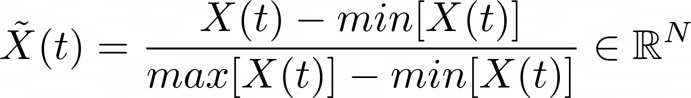
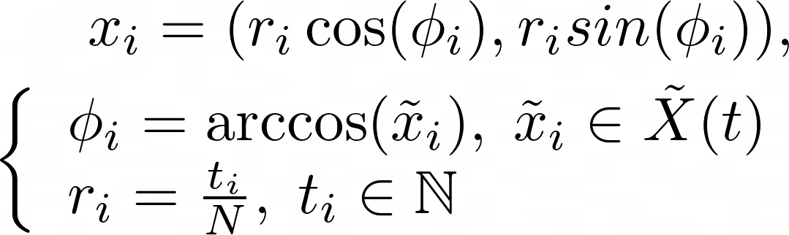
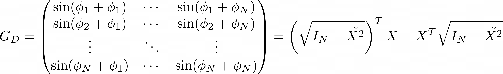
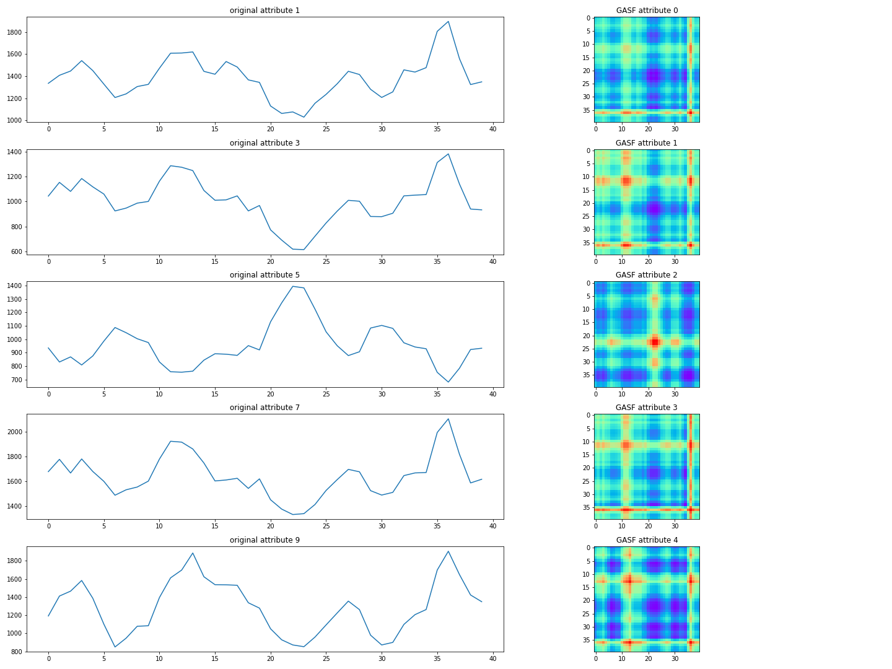
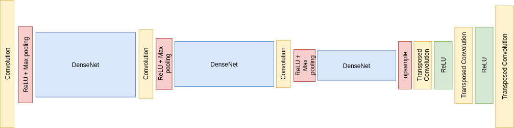
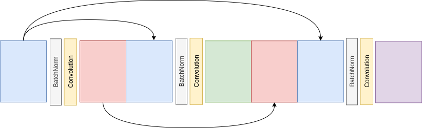

# Gaf-cnn

This repository contains an implementation of a multivariate time series to multivariate time series regression model using gramian angular field encoding to represent time series as images. It was inspired by the framework proposed by Z. Wang and T. Oates in [1] and was extended to multivariate problems. Unlike the original paper, the architecture of the model is based on the residual network variant proposed by Huang et al. in [2] called `DenseNet`.

## Gramian angular field encoding

See [script](/data/transforms.py) or for a non-reversible implementation check <a href="https://pyts.readthedocs.io/en/stable/generated/pyts.image.GramianAngularField.html">pyts</a>.

The gramian angular field of a time serie is a non-linear transformation which yield a square matrix and does not break time dependencies in the input. Given `X(t) = [x(t1), x(t2), ..., X(tN)] = [x1, x2, ..., xN]` a real-valued time serie, we start by rescaling to `[0, 1]`:
<!---$$
\tilde{X}(t) = \frac{X(t) - min[X(t)]}{max[X(t)]-min[X(t)]} \in [//]: # \mathbb{R}^N
 $$--->

Then, the sequence is represented in polar coordinates:
<!---$$
x_i = (r_i\cos(\phi_i), r_isin(\phi_i)),\\
\left\{
	\begin{array}{ll}
		\phi_i=\arccos(\tilde{x}_i),\; \tilde{x}_i \in \tilde{X}(t) \\
		r_i = \frac{t_i}{N},\; t_i \in \mathbb{N}
	\end{array}
\right.
$$--->

Finally, the Gramian Angular Summation Field (GASF) can be computed:
<!---$$
G_S =
    \begin{pmatrix}
    \cos(\phi_1+\phi_1) & \cdots & \cos(\phi_1+\phi_N) \\
    \cos(\phi_2+\phi_1) & \cdots & \cos(\phi_2+\phi_N) \\
    \vdots & \ddots & \vdots \\
    \cos(\phi_N+\phi_1) & \cdots & \cos(\phi_N+\phi_N)
    \end{pmatrix}
= \tilde{X}\tilde{X}^T - \left(\sqrt{I_N-\tilde{X^2}}\right)^T\sqrt{I_N-\tilde{X^2}}
$$--->

The transformation can be reversed as:
<!---$$
\left. {\begin{array}{ll}
{G_{S,ii} = \cos(2\phi_i) = 2\cos^2(\phi_i)-1}\\
{\phi_i=\arccos(\tilde{x}_i)}
\end{array}} \right\}\Rightarrow \tilde{x}_i = \sqrt{\frac{cos(2\phi_i)+1}{2}} = \sqrt{\frac{G_{S,ii}+1}{2}}
$$--->

Note that the Gramian Angular Difference Field (GADF) can also be computed but was not used as it is not injective. For completeness, here is its definition:
<!---$$
G_D=
\begin{pmatrix}
    \sin(\phi_1+\phi_1) & \cdots & \sin(\phi_1+\phi_N) \\
    \sin(\phi_2+\phi_1) & \cdots & \sin(\phi_2+\phi_N) \\
    \vdots & \ddots & \vdots \\
    \sin(\phi_N+\phi_1) & \cdots & \sin(\phi_N+\phi_N)
\end{pmatrix}
= \left(\sqrt{I_N-\tilde{X^2}}\right)^TX - X^T\sqrt{I_N-\tilde{X^2}}
$$--->

## Data Processing

### Loading and processing

See [script](/data/loaders.py).

The data usually comes in a data frame `df` in which each row contains the values of `L` attributes at a given time stamp. We start by dropping potential useless columns, then the missing values are filled by linear interpolation. The `L` columns are then split into two distinct subsets, `K` feature and `M` target attributes leading to the new data frames `df_X` and `df_Y`. If for some reason the number of feature attributes is too high, `PCA` can be applied to reduce the input dimension. Then, both data frames are turned into 3-dimensional tensors `X` and `Y`  of shape `(n_samples, n_attributes, n_timestamps)`. After that, we divide  `(X, Y)` into training, validation and test set and compute the per-attribute minimum of training set for later normalization. Finally, we wrap each set in a custom PyTorch dataset.

### PyTorch Dataset

See [script](/data/datasets.py).

As computing the GASF of a serie squares the memory required to store it, the transformation is done in the `__getitem__` method of the PyTorch dataset object. Each time a sample is drawn from a set, the features and the targets are independently normalized to [0,1] (using training min/max) and each attribute is transformed into its GASF matrix. Therefore a batch of size `(batch_size, n_attributes, n_timestamps)` is turned into a 4-dimensional tensor `(batch_size, n_attributes, n_timestamps, n_timestamps)` which can be seen as a `n_attrbutes` channels `n_timestamps x n_timestamps` image.

## Regression model

See [here](/models/regression.py) and [here.](/models/resnet.py)

Conceptually, the architecture of the model is very close to the one of an auto-encoder. The first part of the network, the encoder, is a usual CNN stacking convolutions, relu activations and batch normalization. In between these layers, residual blocks (`DenseNet` [2]) are placed to extract features while keeping as much signal as possible. This proved to be useful to avoid destroying sparse input signals. The first convolution layer `in_channels` parameter matches the number of input attributes.For the decoding part, we start by adjusting the size of the image with an upsampling layer. Then, the decoder is a stack of transposed convolution followed by relu activations, except for the last layer so that the output can take any values.

The `DenseNet` architecture takes a tensor, applies a convolution conserving the image size, concatenate the output with the input of each following convolutional layer in the network.

## Usage

To try the model on an another dataset, write a loader in `./data/loaders.py`. Then, copy the notebook `air_quality_gaf_to_gaf.ipynb` and adjust the parameters in the `Opt` class:

- `n_timestamps`: number of timestamps of the time series
- `test_size`: fraction of samples reserved for testing
- `val_size`: fraction of samples reserved for validation
- `seed`: random generator seed
- `x_transformation`: transformation to apply to the inputs, currently only `gasf` is supported
- `y_transformation`: transformation to apply to the outputs, currently only `gasf` is supported
- `encode_channels`: list of number of channels to map in the encoder
- `decode_channels`: list of number of channels to map in the decoder
- `encode_block_type`: type of residual network block in the encoder, currently only `DenseNet` is supported
- `encode_block_dim`: number of convolutional layers in each `DenseNet` block
- `train_batch_size`: training batch size
- `val_batch_size`: validation batch size
- `learning_rate`
- `weight_decay`
- `num_epochs`: number of training epochs
- `device`: computing device

## Further work

1. Apply the framework to classification. This will allow to use not-injective transformations as Gramian Angular Difference Fields and Markov Transition Fields as described in [1].
2. When the signal is too sparse, the network fails to capture it and the output vanishes. We may try different resnet architectures in order to tackle this problem even though this seems to be a hard limitation of the method.

## References

1. Wang, Z.; Oates, T. Encoding Time Series as Images for Visual Inspection and Classification Using Tiled Convolutional Neural Networks. In Proceedings of the Workshops at AAAI Conference on Artificial Intelligence, Honolulu, HI, USA, 27 January–1 February 2019; pp. 40–46.
2. G. Huang, Z. Liu, K. Q. Weinberger and L. Maaten. Densely Connected Convolutional Networks. arXiv:1608.06993v3,2016.